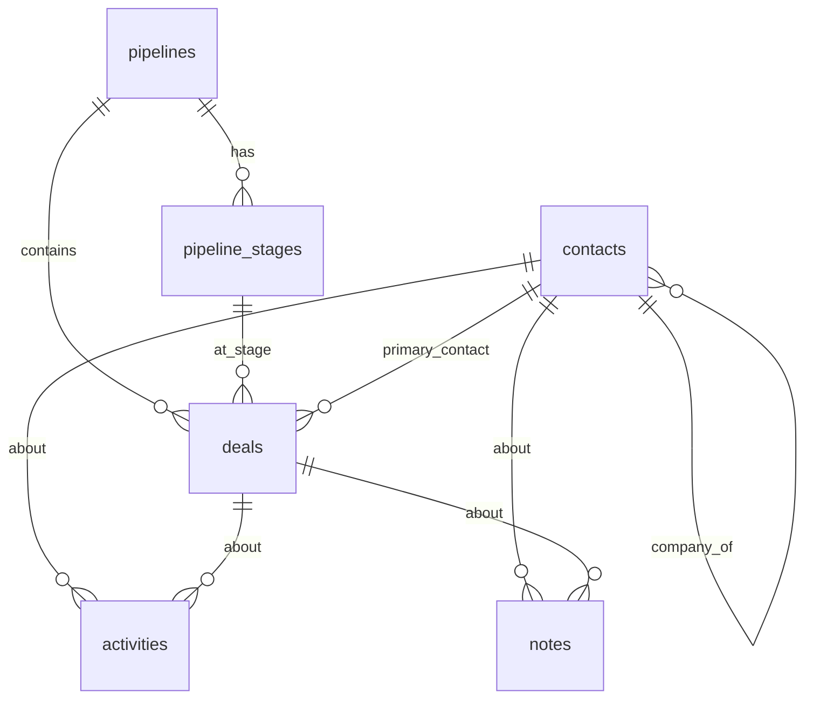

# CRM Backend (OMN-59)

Supabase backend for the Internal CRM. Project: **Convergence** (`krthbgtykwamxqvapxnx`), schema `public`.

## Canonical tables

| Table | Purpose |
|-------|---------|
| `pipelines` | Named pipelines (supports more than one) |
| `pipeline_stages` | Ordered, configurable stages per pipeline (default probability, won/lost flags) |
| `contacts` | Polymorphic companies + people (`kind` = `company`/`person`); people link to a company via `company_id` |
| `deals` | Opportunities — value, currency, stage, probability, **computed `weighted_value`**, status, close dates |
| `activities` | Timeline events (`call`/`email`/`meeting`/`note`/`task`/`other`) linked to a contact and/or deal |
| `notes` | Freeform notes linked to a contact and/or deal |
| `deal_pipeline_summary` (view) | Weighted forecast rollup per stage |

## Entity diagram



## Computed fields (no edge function required)

- `deals.weighted_value` = `round(value * coalesce(probability,0), 2)` — a **stored generated column**, always consistent, no app code needed.
- `deals.probability` defaults to the stage's `default_probability` (trigger) when left null.
- `deals.status` / `closed_at` auto-sync when a deal enters a won/lost stage (trigger).
- `deal_pipeline_summary` view aggregates open-deal weighted value per stage for dashboards/forecasts.

An edge function was evaluated and is **not needed** — generated columns + a view cover the computed-field requirement more reliably (no cold starts, transactional consistency).

## Security model (RLS)

Single-team: **authenticated** users have full CRUD on all CRM tables; **anon** has no access. Use Supabase Auth (email/password, same as the EOS app) — never the anon key for data access. A per-user ownership variant (owner_id = auth.uid()) is included as commented SQL in `0001_crm_init_schema.sql` if private data is required later.

## Frontend usage (supabase-js)

```ts
import { createClient } from '@supabase/supabase-js'
import type { Database } from './crm.types'

const supabase = createClient<Database>(SUPABASE_URL, SUPABASE_ANON_KEY)
await supabase.auth.signInWithPassword({ email, password }) // required — RLS denies anon

// Deals on the default pipeline, with stage + contact
const { data } = await supabase
  .from('deals')
  .select('*, pipeline_stages(name,position), contacts(name)')
  .order('expected_close_date')

// Weighted forecast per stage
const { data: forecast } = await supabase.from('deal_pipeline_summary').select('*')
```

Types: see `crm.types.ts` (generated via `supabase gen types`). Regenerate after schema changes.

## Files
- `0001_crm_init_schema.sql` — schema, indexes, triggers, view, RLS (applied as migration `crm_init_schema`)
- `0002_crm_seed.sql` — demo/preview seed (applied)
- `crm.types.ts` — generated TypeScript types for the frontend
